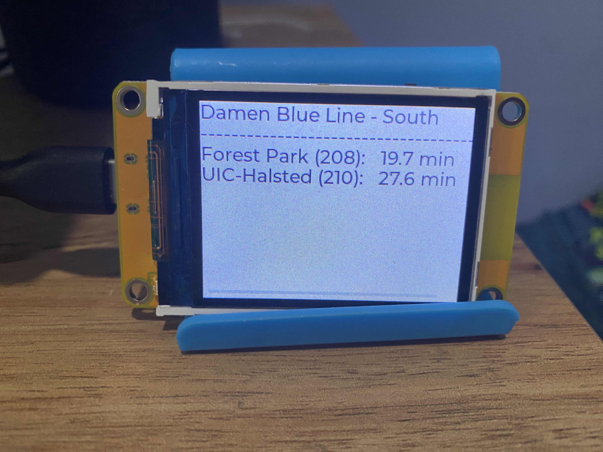

# CTA Train Tracker for Cheap Yellow Display (CYD) boards. esp32-2432S024N, esp32-2432S022N

For [PlatformIO](https://platformio.org/)

This application was based on the Github Repo [esp32-smartdisplay](https://github.com/rzeldent/esp32-smartdisplay) library that is intended to be used in [PlatformIO](https://platformio.org/).
See [https://github.com/rzeldent/esp32-smartdisplay](https://github.com/rzeldent/esp32-smartdisplay/) for more information about the driver library.

-------------------------------------------------------------------------------------------------------------------------------------------------

Example of [ESP32-2432S022N on AliExpress](https://www.aliexpress.us/item/3256806097839998.html?spm=a2g0o.order_list.order_list_main.20.21ef1802zxQefl&gatewayAdapt=glo2usa)

Example of [ESP32-2432S024N on AliExpress](https://www.aliexpress.us/item/3256805678792605.html?spm=a2g0o.order_list.order_list_main.25.21ef1802zxQefl&gatewayAdapt=glo2usa)

The **files are currently configured for the x22N board**. You can use another Sunton ESP32 board, but you will need to update the following files: 

**\platformio.ini file** - will need to update the board to have the correct model number

**\src\_train22in.cpp file** - I've appended '.backup' to each .cpp file not in use to avoid compiling issues. There should only be one. 

---- If you decide you want to use another Sunton display board (besides the 22N or 24N), please refer to the following github repository which provides additional board definitions: 
[https://github.com/rzeldent/platformio-espressif32-sunton](https://github.com/rzeldent/platformio-espressif32-sunton)

The main things to update in the scripts are: 
- You Wifi SSID
- You Wifi Password
- CTA API Key
- Train Station (currently set for Damen Blue Line. i.e. mapid=40590)
- Header Text (currently hardcoded for Damen Blue Line - South"

Other Dependencies: 

You will also need to get your own api key for the CTA Train Tracker, **[found here](https://www.transitchicago.com/developers/traintrackerapply/)**

These files are also configured for the Damen Blue Line. If you want to updated, please refer to the CTA Train Tracker [Documentation](https://www.transitchicago.com/developers/ttdocs/)

Lastly, apologies in advance for the lack of documentation in the code. I don't expect anyone to use it. Hopefully, what I've provided is enough for you to replicate it yourself and change which station and filters you want. 

  
